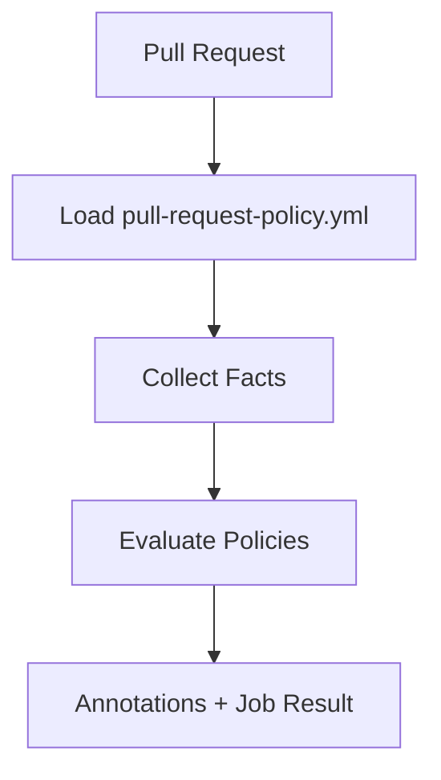

# How It Works

`pull-request-policy` runs as a GitHub Action on every pull request. It loads a YAML policy file, collects the PR facts those policies need, evaluates the rules, and reports results as CI annotations.

## Evaluation flow



For each policy:

- If `when` is defined and does not match → **skip**
- If `when` matches (or is absent), evaluate `require`:
  - passes → ✓
  - fails → violation (annotated; job fails for `error` severity)

## Policy structure

```yaml
- id: auth-needs-two-approvals
  severity: error # error = fail CI, warn = annotate only
  when:
    changed: ['src/auth/**'] # optional trigger condition
  require:
    approval_count_at_least: 2 # what must be true when triggered
  message: 'Auth changes require 2 write-or-higher approvals.'
```

`when` is optional. Without it, `require` is evaluated on every PR.

## Facts collected

| Fact                     | Source                                                       |
| ------------------------ | ------------------------------------------------------------ |
| Changed files            | GitHub API diff                                              |
| PR title / body / labels | GitHub API                                                   |
| Approval count           | Approved reviewers with GitHub `write` or `admin` permission |
| File existence           | Checked-out repo                                             |
| File contents            | Checked-out repo (only when `file_contains` is used)         |

File contents are read lazily — only if a `file_contains` predicate is present.

## Combinators

Predicates compose with `all`, `any`, and `not`:

```yaml
require:
  any:
    - changed: ['CHANGELOG.md']
    - has_label: ['skip-changelog']
```

## Severity

- `error` — fails CI
- `warn` — annotates PR, does not fail (unless `fail-on-warn: true`)

---

For predicate syntax, see [Configuration Reference](configuration.md).
For module internals, see [Architecture](architecture.md).
