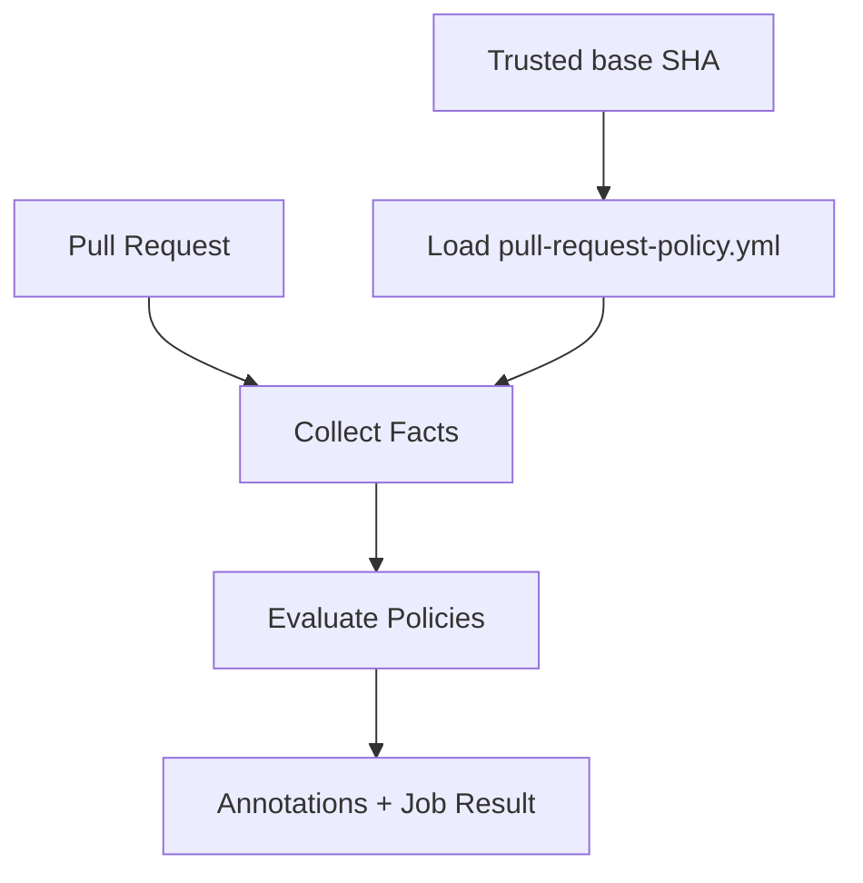

# How It Works

`pull-request-policy` runs as a GitHub Action on every pull request. It loads the YAML policy file from the pull request's base SHA, collects the PR facts those policies need, evaluates the rules, and reports results as CI annotations. See [Base-SHA Configuration Loading](base-sha-config.md) for what this means when a PR changes a policy file or test fixture.

## Evaluation flow



For each policy:

- If `when` is defined and does not match → **skip**
- If `when` matches (or is absent), evaluate `require`:
  - passes → ✓
  - fails → violation (annotated; audit reports it, enforce fails for `error` severity)

## Policy structure

```yaml
policies:
  auth:
    when:
      changed: src/auth/**
    approvals: 2
```

This compact form defaults to `error`, generates the message, and normalizes to
the full `Policy` representation. Use the full policy form for advanced
predicates and combinators. `when` is optional in the full form; without it,
`require` is evaluated on every PR.

## Facts collected

| Fact                     | Source                                                       |
| ------------------------ | ------------------------------------------------------------ |
| Changed files            | GitHub API diff                                              |
| PR title / body / labels | GitHub API                                                   |
| Approval count           | Approved reviewers with GitHub `write` or `admin` permission |
| File existence           | GitHub tree API at the pull request head SHA                 |
| File contents            | GitHub Contents API at the pull request head SHA             |

File contents are read lazily — only if a `file_contains` predicate is present.

## Combinators

Predicates compose with `all`, `any`, and `not`:

```yaml
require:
  any:
    - changed: ['CHANGELOG.md']
    - label: ['skip-changelog']
```

## Severity

- `error` — fails CI
- `warn` — annotates PR and does not fail

## Trial mode

`mode: audit` evaluates every policy and reports violations, but never fails the
job. The default `mode: enforce` fails only `error` violations. A practical
rollout is: generate, run in audit mode, inspect one real PR, switch to enforce,
then change gradual-rollout policies from `warn` to `error` and require the check
in branch protection.

---

For predicate syntax, see [Configuration Reference](configuration.md).
For module internals, see [Architecture](architecture.md).
